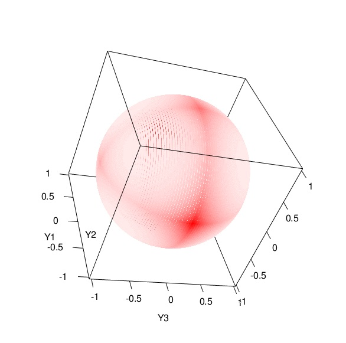
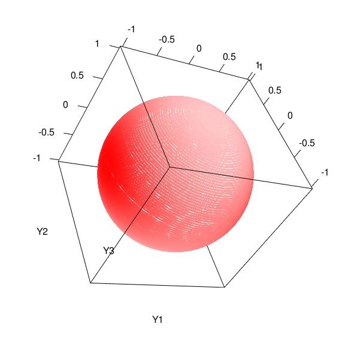

```{r setup, include=FALSE}
knitr::opts_chunk$set(echo = TRUE)
rgl::setupKnitr()
```

## Introduction

We compare two family of prior distributions: Gaussian and Laplacian distributions. Without loss of generality, we study density on a unit ball: $B_1=\{r | r^2=1\}$.


## Bivariate Gaussian vs Bivariate Laplace

```{r, fig.width=5, fig.height=5}
library(mvtnorm)
library(tidyverse)
library(rmutil)
library(rgl)


# create 2d grid over the unit ball
#######################################################

# grid over the unit ball
theta0 <- seq(0,2*pi,length.out=10000)
Y1 <- cos(theta0); Y2 <- sin(theta0)
Y <- cbind(Y1,Y2)

# variance parameters
w1 <- 0.3
w2 <- 0.7


# Densities
#######################################################

# Gaussian
dn <- dmvnorm(Y, mean=c(0,0), sigma=diag(c(w1,w2)))
dn_n <- dn/max(dn) # normalize density so that maximum becomes 1

# Laplace
dl1 <- dlaplace(Y1, m=0, s=sqrt(w1/2))
dl2 <- dlaplace(Y2, m=0, s=sqrt(w2/2))
dl <- dl1*dl2
dl_n <- dl/max(dl) # normalize 


# Density Plot: in coordinate systems
# x-axis: y1 (first coordiante);
# y-axis: y2 (second coordinate);
# color: by density (higher density = darker color)
#######################################################
df.sparse <- data.frame(x = c(1,-1,0,0), # sparse points on the unit ball
                        y = c(0,0,1,-1))

ggplot()+
  geom_point(aes(x=Y1, y=Y2), col='blue', alpha=dn_n/100)+
  geom_point(data=df.sparse, aes(x=x, y=y), col='black', size=2)+
  ggtitle("Bivariate Gaussian Density on the unit ball")

ggplot()+
  geom_point(aes(x=Y1, y=Y2), col='red', alpha=dl_n/100)+
  geom_point(data=df.sparse, aes(x=x, y=y), col='black', size=2)+
  ggtitle("Bivariate Laplace Density on the unit ball")


# Density Plot: as a function of angles
# x-axis: angle (from 0 to 2pi);
# y-axis: density;
# color: by density (higher density = darker color)
#######################################################

ggplot()+
  geom_line(aes(x=theta0, y=dn_n, col='Gaussian'))+
  geom_line(aes(x=theta0, y=dl_n, col='Laplace'))+
  scale_x_continuous(breaks=c(0,pi/2,pi,3/2*pi,2*pi))+
  scale_y_continuous(limits = c(0,NA))+
  geom_vline(xintercept=c(0,pi/2,pi,3/2*pi,2*pi), col='grey')+
  ggtitle("Bivariate Density on the unit ball")

```


## Trivariate Gaussian vs Trivariate Laplace


```{r}
# 3d grid over the unit ball
theta1 <- seq(0,2*pi, length.out=200)
theta2 <- seq(0,2*pi, length.out=200)
theta.grid <- expand.grid(t1=theta1, t2=theta2)

Y1 <- sin(theta.grid[,1])*cos(theta.grid[,2]); Y2 <- sin(theta.grid[,1])*sin(theta.grid[,2]); Y3 <- cos(theta.grid[,1])
Y <- cbind(Y1,Y2, Y3)

# variance parameters
w1 <- 0.5
w2 <- 0.3
w3 <- 0.2


# Densities
#######################################################

# Gaussian
dn <- dmvnorm(Y, mean=c(0,0,0), sigma=diag(c(w1,w2,w3)))
dn_n <- dn/max(dn) # normalize density so that maximum becomes 1

# Laplace
dl1 <- dlaplace(Y1, m=0, s=sqrt(w1/2))
dl2 <- dlaplace(Y2, m=0, s=sqrt(w2/2))
dl3 <- dlaplace(Y3, m=0, s=sqrt(w3/2))
dl <- dl1*dl2*dl3
dl_n <- dl/max(dl) # normalize 
```

```{r, eval=FALSE}
# 3d plot
intervals   = seq(0,1,1/50)
gradient <- colorRampPalette(colors = c("white","red"))
colours <- gradient(length(intervals))

dl_n_col       =  colours[findInterval(dl_n, intervals)]
dn_n_col       = colours[findInterval(dn_n, intervals)]

open3d()

plot3d(Y1,Y2,Y3, col=dn_n_col, lit=FALSE)
spheres3d(0,0,0,lit=FALSE,color="white")
#spheres3d(0,0,0,radius=1.01,lit=FALSE,color="grey",front="lines")
aspect3d(1,1,1)
# Create a movie
movie3d(spin3d(axis = c(1, 1, 1), rpm=5), duration = 5,
        movie="GaussianBall",
        dir = getwd())

plot3d(Y1,Y2,Y3, col=dl_n_col)
movie3d(spin3d(axis = c(1, 1, 1), rpm=5), duration = 5,
        movie="LaplacianBall",
        dir = getwd())
```

### The Laplacian Ball



A more interesting! moving gif is available here: 

[Laplacian Ball] (https://github.com/joonsukkang/mf/blob/master/output/LaplacianBall.gif) and also
[Gaussian Ball] (https://github.com/joonsukkang/mf/blob/master/output/GaussianBall.gif)


### The Gaussian Ball




## More Explorations on Bivariate Laplace

### When $w_1$ changes while the sum $w_1+w_2=1$ is fixed

By symmetry, we only need to consider the range $w_1\leq 0.5$. 


```{r}
# the 2d grid
Y1 <- cos(theta0); Y2 <- sin(theta0); Y <- cbind(Y1,Y2)

data.frame(w1=seq(0.05,0.5, by=0.05)) %>%
  mutate(w2=1-w1) -> df.w

df.result <- data.frame()

# Densities
#######################################################

for (i in 1:nrow(df.w)){
w1 <- df.w$w1[i]; w2 <- df.w$w2[i]

# evaluate Laplace density over the ball
dl1 <- dlaplace(Y1, m=0, s=sqrt(w1/2))
dl2 <- dlaplace(Y2, m=0, s=sqrt(w2/2))
dl <- dl1*dl2
dl_n <- dl/max(dl) # normalize 

df.result <- rbind(df.result,
                   data.frame(theta=theta0,
                        w1=w1,
                        w2=w2,
                        density = dl_n))
}

df.result %>% group_by(w1) %>%
  ggplot()+
  geom_line(aes(x=theta, y=density, group=w1, col=w1))+
  scale_x_continuous(breaks=c(0,pi/2,pi,3/2*pi,2*pi))+
  scale_y_continuous(limits = c(0,NA))+
  geom_vline(xintercept=c(0,pi/2,pi,3/2*pi,2*pi), col='grey')+
  ggtitle("Bivariate Laplace Density around the unit ball")
```

### When $w_1$ changes while the ratio $w_1/w_2$ is fixed

The smallest variance parameters ($w_1=w_2=0.05$) produces the most sparsity-inducing prior on $l$; the case with largest variance $(w_1,w_2)=(2,2)$ produces the least sparsity-inducing prior. As $N$ increases, we have increasing number of variance parameters $\{w_i\}_{i=1}^N$ to allocate the budget $\sum_{i=1}^Nw_i =r^2=1$ and are more likely to have a sparser prior.


```{r}
data.frame(w1=c(0.05, 0.1, 0.2, 0.5, 1, 1.5, 2)) %>%
  mutate(w2=w1) -> df.w

df.result <- data.frame()

# Densities
#######################################################

for (i in 1:nrow(df.w)){
w1 <- df.w$w1[i]; w2 <- df.w$w2[i]

# evaluate Laplace density over the ball
dl1 <- dlaplace(Y1, m=0, s=sqrt(w1/2))
dl2 <- dlaplace(Y2, m=0, s=sqrt(w2/2))
dl <- dl1*dl2
dl_n <- dl/max(dl) # normalize 

df.result <- rbind(df.result,
                   data.frame(theta=theta0,
                        w1=w1,
                        w2=w2,
                        density = dl_n))
}

df.result %>% group_by(w1) %>%
  ggplot()+
  geom_line(aes(x=theta, y=density, group=w1, col=w1))+
  scale_x_continuous(breaks=c(0,pi/2,pi,3/2*pi,2*pi))+
  scale_y_continuous(limits = c(0,NA))+
  geom_vline(xintercept=c(0,pi/2,pi,3/2*pi,2*pi), col='grey')+
  ggtitle("Bivariate Laplace Density around the unit ball")
```

